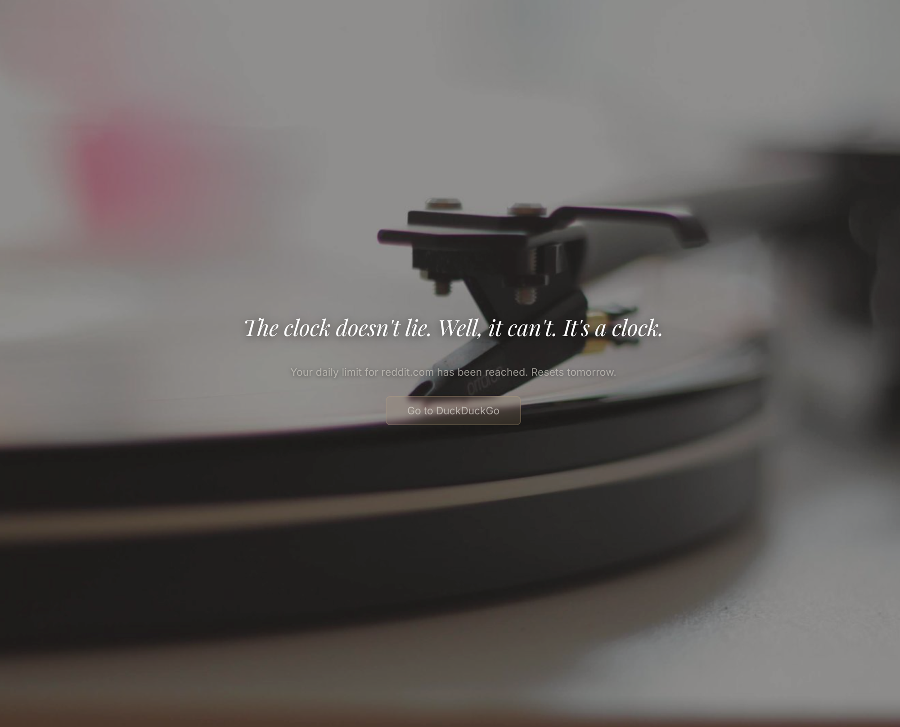

# Zenwall

Block distracting websites. See nature instead.

Zenwall is a Chrome extension that replaces distracting sites with calming nature photos and witty messages. Fully block sites, or give yourself a daily time budget — when time's up, the wall goes up.

## Install

1. Clone or download this repo
2. Open `chrome://extensions` in Chrome
3. Turn on **Developer mode** (top right)
4. Click **Load unpacked** and select the `zenwall` folder
5. Pin the Zenwall icon in your toolbar

To update after pulling changes, hit the refresh icon on `chrome://extensions`.

## How to use

### Block a site on the fly

1. Go to any site you want to block
2. Click the Zenwall icon
3. Choose one of:
   - **Block entire domain** — gone forever
   - **Block this URL** — just this specific page
   - **Set daily time limit** — allow yourself X minutes per day

### Manage your block list

Click "Manage blocked sites" in the popup to open settings. From there you can add patterns, edit time limits, switch between full block and timed mode, or remove sites.

Pattern examples:
- `reddit.com` — blocks reddit
- `*.reddit.com` — blocks reddit and all subdomains
- `example.com/feed/*` — blocks a specific path

### Daily time limits

Set a time budget for sites you don't want to fully block. The timer counts down while you browse, and when your time is up, the block page appears — even if you're mid-scroll.

Timer resets every day at midnight. You can increase the limit from settings, but Zenwall will make you work for it.

### Stats

The popup shows how many times you've been blocked and which sites you visit most. A small reminder of what you're up against.

## What you'll see

When you hit a blocked site, you get a random nature photo and a message. Some are poetic, some are sarcastic, some are zen. Timer expirations get their own set of messages.

## Image Credits

Nature photographs sourced from [Unsplash](https://unsplash.com) via [Lorem Picsum](https://picsum.photos). All images are free to use under the [Unsplash License](https://unsplash.com/license).

## License

MIT
